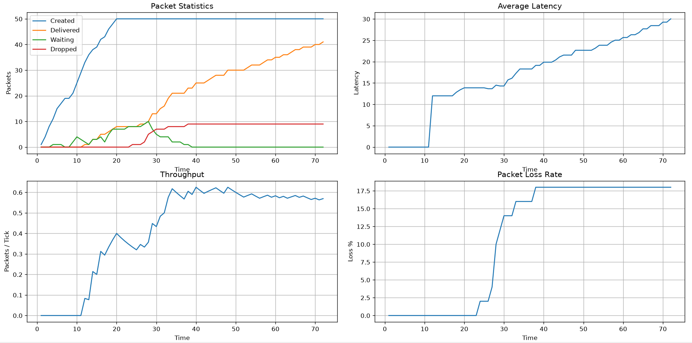

# Congestion-Aware Network Traffic Simulator


A packet-level network simulator built in C++ that models network traffic flow, congestion, routing decisions, link failures, packet drops, and network performance metrics.

---

## Overview

Modern computer networks continuously make routing decisions while handling congestion, failures, and varying traffic loads. This project simulates those behaviors by representing a network as a graph of routers and links, where packets are generated, routed, delayed, dropped, or re-routed based on current network conditions.

The simulator provides insights into:

- Packet routing behavior
- Network congestion effects
- Link utilization
- Dynamic path selection
- Fault tolerance through rerouting
- Latency and throughput analysis

The project also includes Python-based visualization tools for analyzing simulation results.

---

## Features

### Core Network Simulation

- Graph-based network topology
- Router and link representation
- Configurable link capacities
- Configurable link latencies
- Bidirectional communication links

### Packet Routing

- Dijkstra shortest-path routing
- Dynamic route computation
- Multi-hop packet traversal
- Packet scheduling with custom arrival times

### Congestion Awareness

- Real-time link utilization tracking
- Congestion-aware routing cost function
- Dynamic path recalculation under congestion
- Adaptive rerouting decisions

### Fault Tolerance

- Link failure simulation
- Automatic route recomputation
- Traffic redirection around failed links

### Traffic Management

- Packet waiting queues
- Capacity-based admission control
- Packet dropping after excessive waiting
- Network load tracking

### Performance Analytics

- Average latency calculation
- Throughput measurement
- Packet delivery statistics
- Packet loss rate analysis
- Simulation history export to CSV

### Visualization

- Python dashboard for simulation metrics
- Time-series performance graphs
- Congestion monitoring plots
- Network analytics using Pandas and Matplotlib

---

## System Architecture

```text
+-------------------+
| Packet Generator  |
+---------+---------+
          |
          v
+-------------------+
| Simulator Engine  |
+---------+---------+
          |
          v
+-------------------+
| Routing Algorithm |
|  (Dijkstra)       |
+---------+---------+
          |
          v
+-------------------+
| Network Graph     |
| Routers + Links   |
+---------+---------+
          |
          v
+-------------------+
| Statistics Engine |
+---------+---------+
          |
          v
+-------------------+
| CSV Export        |
+---------+---------+
          |
          v
+-------------------+
| Python Dashboard  |
+-------------------+
```

---

## Routing Strategy

The simulator uses a modified Dijkstra algorithm.

Instead of considering only latency, routing decisions incorporate current network congestion:

```

Cost = Latency + α × Utilization

```

Where:

- Latency = Link transmission delay
- Utilization = CurrentLoad / Capacity
- α = Congestion penalty coefficient

This encourages packets to avoid heavily congested paths even if they are shorter.

---

## Link Failure Simulation

The simulator supports dynamic link failures during execution.

Example:

```cpp
network.disableEdge(1, 3);
```

When a link becomes unavailable:

1. Packets attempting to use the failed link are blocked.
2. The routing algorithm recalculates an alternative path.
3. Traffic is redirected if a valid route exists.
4. Packets are dropped if no path is available.

---

## Performance Metrics

The simulator tracks:

| Metric | Description |
|----------|------------|
| Packets Created | Total generated packets |
| Packets Delivered | Successfully delivered packets |
| Packets Dropped | Packets discarded due to failures or excessive waiting |
| Packets Waiting | Packets currently blocked by congestion |
| Average Latency | Average delivery time of successful packets |
| Throughput | Delivered packets per simulation tick |
| Packet Loss Rate | Percentage of dropped packets |

---

## Project Structure

```text
Congestion-Aware-Network-Traffic-Simulator
│
├── cpp
│   ├── Graph.cpp
│   ├── Graph.h
│   ├── Simulator.cpp
│   ├── Simulator.h
│   ├── CongestionDijkstra.cpp
│   ├── CongestionDijkstra.h
│   └── main.cpp
│
├── python
│   └── dashboard.py
│
├── results
│   └── sample_output.csv
│
├── CMakeLists.txt
├── requirements.txt
└── README.md
```

---

## Building the Project

### Prerequisites

- C++17 compatible compiler
- CMake 3.15+
- Python 3.10+

### Build

```bash
cmake -B build
cmake --build build
```

---

## Running the Simulation

Execute:

```bash
./build/simulator
```

The simulator will:

- Generate packets
- Route traffic
- Simulate congestion
- Handle failures
- Export simulation statistics

Output CSV:

```text
results/simulation.csv
```

---

## Python Dashboard

Install dependencies:

```bash
pip install -r requirements.txt
```

Run:

```bash
python python/dashboard.py
```

The dashboard visualizes:

- Packet delivery trends
- Average latency over time
- Waiting packets
- Network performance metrics

---

## Dashboard Preview

The simulator exports performance metrics to CSV files which can be visualized using the Python analytics dashboard.

The dashboard provides:

- Packet creation, delivery, waiting and drop statistics
- Average packet latency over time
- Throughput monitoring
- Packet loss analysis

### Example Output



---

## Experimental Results

A sample simulation with 50 packets demonstrates:

- Successful packet delivery under congestion
- Dynamic rerouting after link failures
- Congestion-aware path selection
- Packet dropping under prolonged network saturation

Observed metrics:

| Metric | Value |
|----------|----------|
| Packets Created | 50 |
| Packets Delivered | 41 |
| Packets Dropped | 9 |
| Peak Waiting Packets | 10 |
| Final Throughput | ~0.57 packets/tick |
| Packet Loss Rate | 18% |
| Average Latency | ~30 ticks |
---

## Technologies Used

### Backend

- C++
- STL
- Object-Oriented Design

### Algorithms

- Dijkstra's Algorithm
- Priority Queue Based Routing
- Congestion-Aware Cost Modeling

### Data Processing

- CSV Export

### Visualization

- Python
- Pandas
- Matplotlib

---
